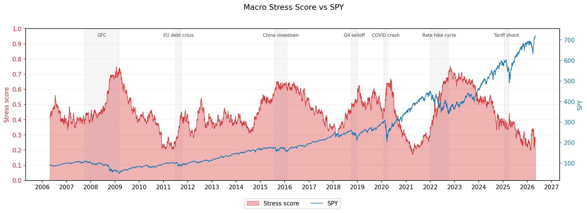
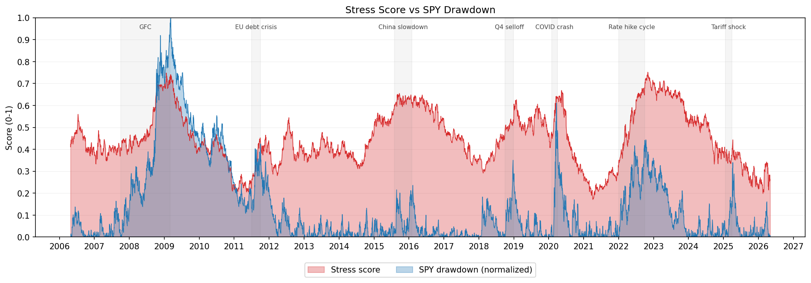
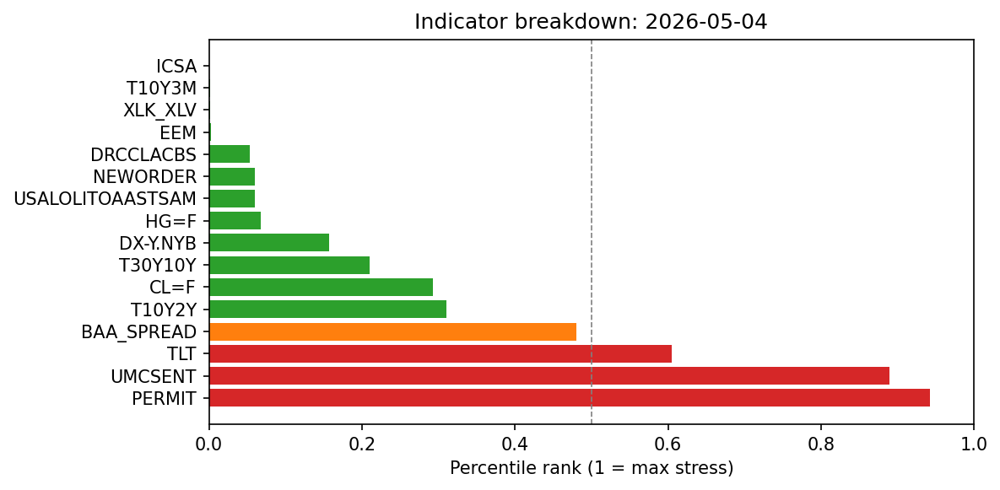
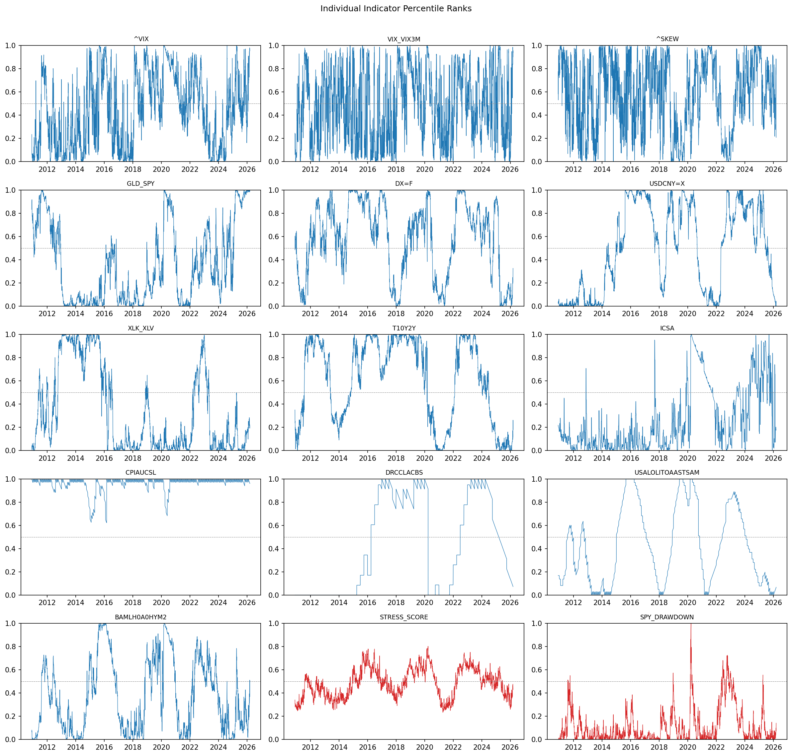
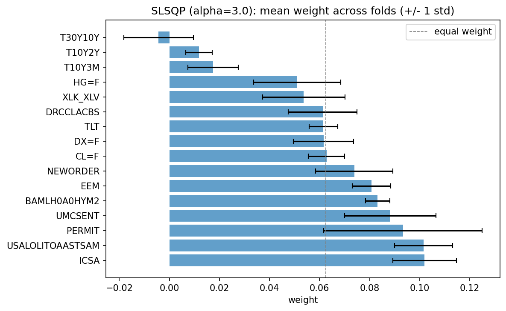
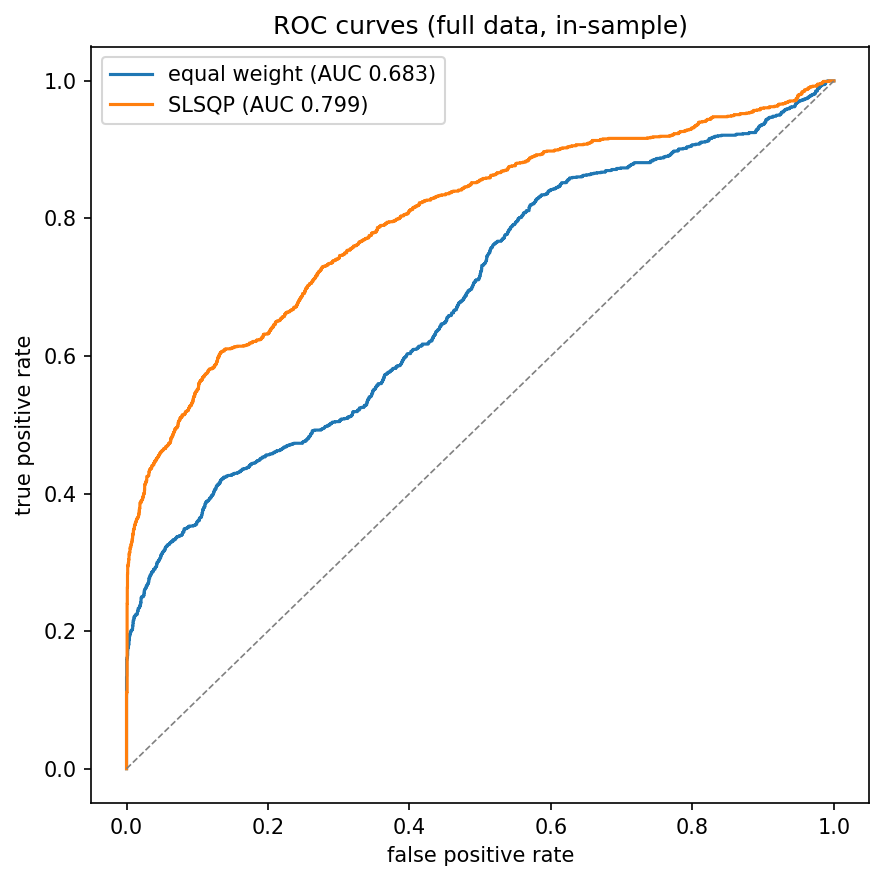
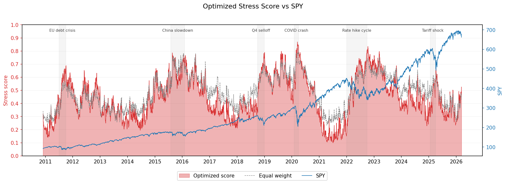
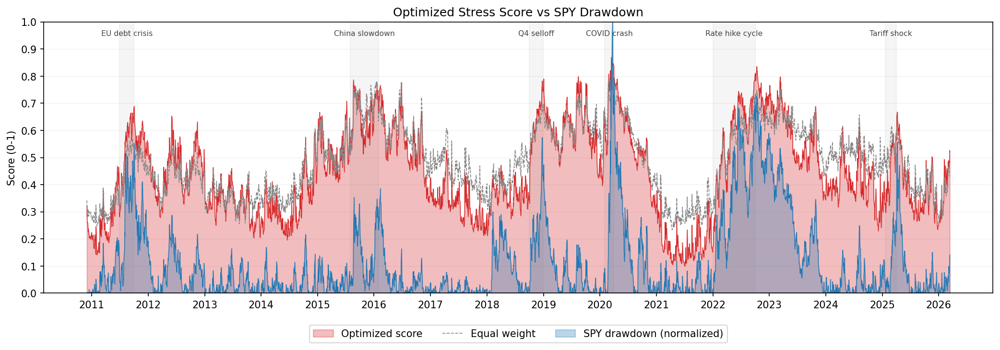

# macro-stress-ml

A macro financial stress pipeline with an ML weight optimizer. The pipeline ingests market and FRED data, computes a composite stress score across 16 leading indicators, and writes the result to parquet. The optimizer learns per-indicator weights that maximize AUC between the weighted stress score and realized SPY drawdown labels.

The stress score is a forward-looking risk indicator built from indicators with demonstrated leading properties. Reactive and coincident indicators (VIX, SKEW, CPI, USD/CNY, gold/equity ratio) were excluded. Optimized weights improve historical fit; they are not a trading signal.

## Indicators

**Yield curve (FRED)**
| Series | Indicator |
|---|---|
| `T10Y2Y` | 10Y-2Y Treasury spread |
| `T10Y3M` | 10Y-3M Treasury spread |
| `T30Y10Y` | 30Y-10Y Treasury spread |

**Macro leading (FRED)**
| Series | Indicator |
|---|---|
| `USALOLITOAASTSAM` | OECD composite leading indicator |
| `UMCSENT` | University of Michigan consumer sentiment |
| `PERMIT` | Building permits |
| `NEWORDER` | Manufacturers new orders |

**Labor and credit (FRED)**
| Series | Indicator |
|---|---|
| `ICSA` | Initial jobless claims |
| `DRCCLACBS` | Credit card delinquency rate |
| `BAMLH0A0HYM2` | ICE BofA HY OAS spread |

**Market (yfinance)**
| Ticker | Indicator |
|---|---|
| `XLK` / `XLV` | Tech vs defensive rotation |
| `TLT` | Long-duration Treasury ETF |
| `HG=F` | Copper futures (growth proxy) |
| `CL=F` | Crude oil futures (rate-of-change; dual stress regime) |
| `EEM` | Emerging markets ETF |
| `DX=F` | DXY dollar index |

## Architecture

```
Pipeline
  fetch_data.py      pulls yfinance + FRED
  process_data.py    merges, resamples, computes ratios
  features.py        rolling percentile rank, direction flip, composite score
  pipeline.py        orchestration, writes stress_score.parquet

        |
        | data/processed/stress_score.parquet
        v

ML
  labels.py          derives binary SPY drawdown labels from parquet
  optimizer.py       SLSQP weight optimization, alpha sweep, CV evaluation
```

Both packages are installed from `src/` via `pyproject.toml`. The ML package does not import from the pipeline package; the parquet file is the only interface.

## Setup

Requires [uv](https://docs.astral.sh/uv/).

```bash
git clone https://github.com/your-username/macro-stress-ml.git
cd macro-stress-ml
uv sync
```

FRED requires a free API key. Create a `.env` file in the project root:

```
FRED_API_KEY=your_key_here
```

Get a key at [fred.stlouisfed.org](https://fred.stlouisfed.org/docs/api/api_key.html).

## Usage

**Run the pipeline** (fetches data, writes parquet):

```bash
uv run main.py
```

Outputs:
- `data/raw/market_raw.csv`: raw yfinance closes
- `data/raw/fred_raw.csv`: raw FRED series
- `data/processed/stress_score.parquet`: stress score with all ranked indicators and SPY

**Run the optimizer** (requires pipeline output):

```bash
uv run optimize.py
```

Outputs:
- `data/processed/optimized_weights.json`: per-indicator weights, equal-weight AUC, optimized AUC

## Notebooks

`notebooks/stress_score_eda.ipynb` visualizes the pipeline output. Run the pipeline first, then open in Jupyter or VS Code.

**Stress score vs SPY**



**Stress score vs SPY drawdown (normalized)**



**Indicator breakdown: most recent observation**



**Individual indicator time series**



`notebooks/weight_optimizer.ipynb` covers the full ML workflow: label construction, SLSQP optimization, alpha sweep via cross-validation, weight stability, ROC curves, and optimized score visualization.

**Optimized vs equal-weight indicator weights**



**ROC curves: equal weight vs optimized**



**Optimized vs equal-weight score overlaid on SPY**



**Optimized vs equal-weight score overlaid on SPY drawdown**



## Development

```bash
uv run pytest          # run tests
uv run ruff check .    # lint
uv run ruff format .   # format
```
